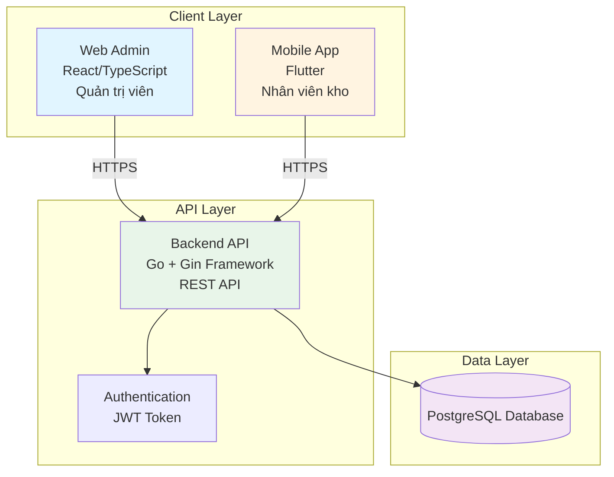
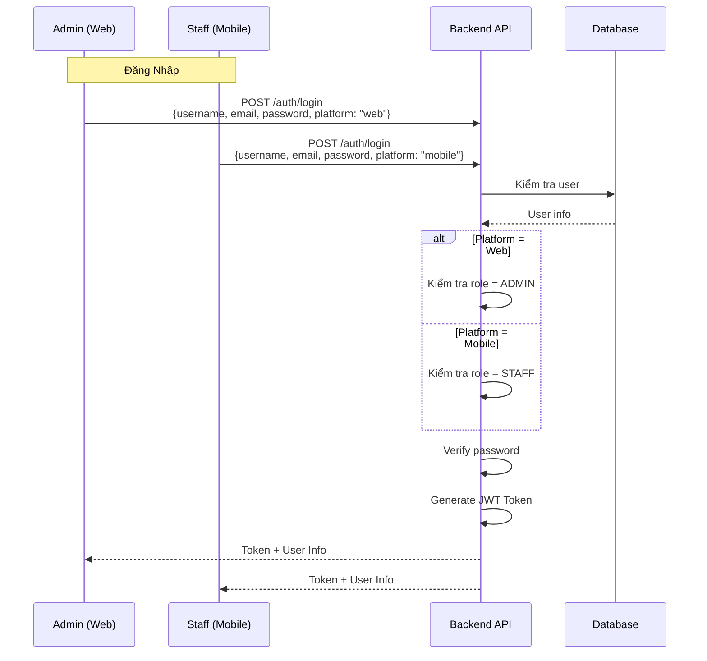
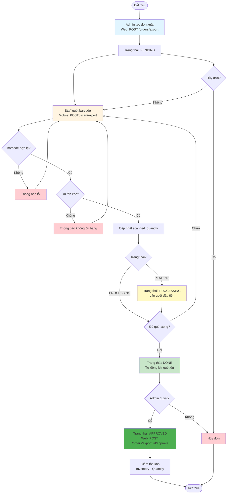
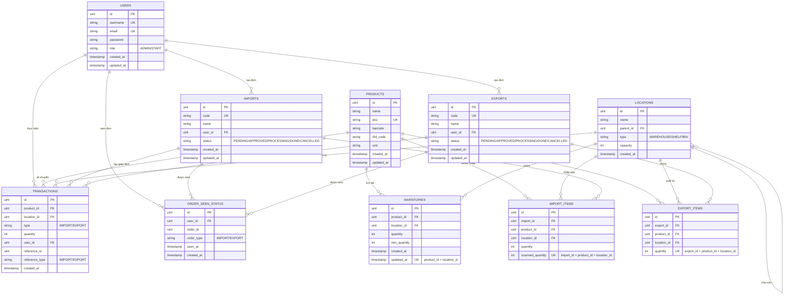
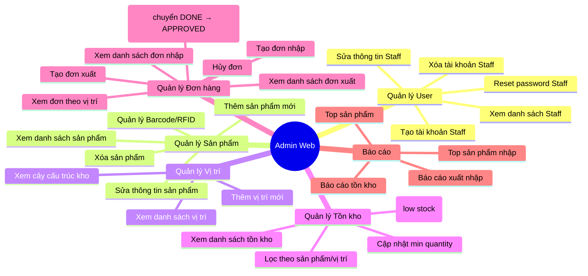
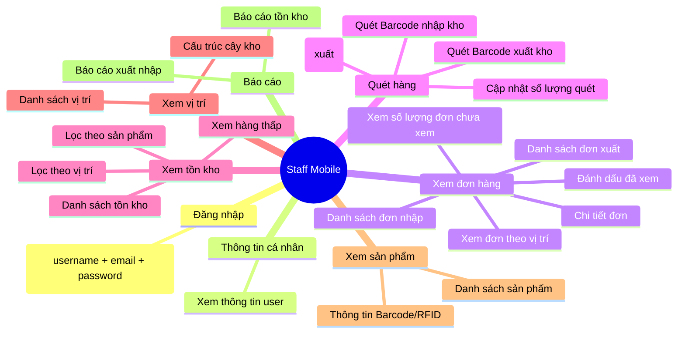
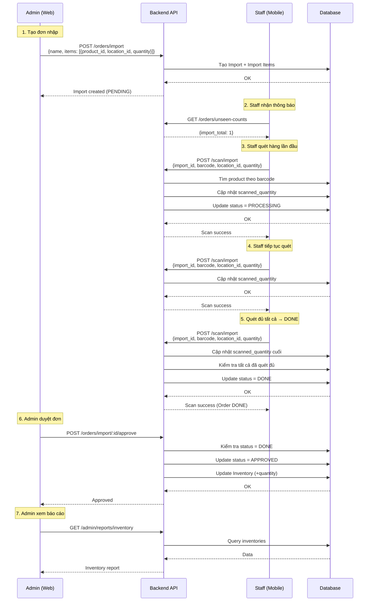
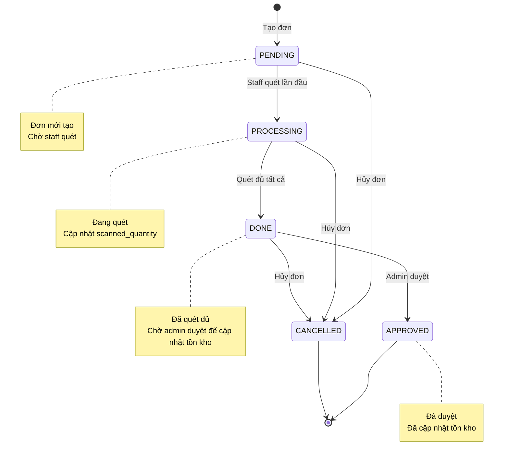

# Flow Hệ Thống Quản Lý Kho (WareFlow)

## 0. Tài Liệu Cho Sếp Và Khách Hàng (Không Cần Hiểu Code)

### 0.1 Tổng Quan Hệ Thống Bằng Ngôn Ngữ Dễ Hiểu

Hệ thống quản lý kho của chúng tôi có 2 phần chính:

**Phần 1 - Web cho Quản trị viên (Admin)**
- Dùng trên máy tính
- Dành cho người quản lý kho
- Tạo đơn hàng, duyệt đơn, xem báo cáo

**Phần 2 - App điện thoại cho Nhân viên kho (Staff)**
- Dùng trên điện thoại
- Dành cho nhân viên làm việc thực tế tại kho
- Quét mã vạch, thực hiện nhập/xuất hàng

**Cách hoạt động chung:**
1. Admin tạo đơn hàng trên Web
2. Staff nhận thông báo trên điện thoại
3. Staff quét mã vạch sản phẩm để thực hiện
4. Hệ thống tự động kiểm tra và cập nhật
5. Admin duyệt đơn để hoàn tất
6. Tồn kho được cập nhật tự động

---

### 0.2 Luồng Dữ Liệu Nhập Kho - Chi Tiết Các Trường Hợp

#### TRƯỜNG HỢP 1: Nhập kho thành công (Luồng chuẩn)

**Bước 1 - Admin tạo đơn nhập**
- Admin đăng nhập vào Web
- Chọn "Tạo đơn nhập"
- Nhập thông tin: tên đơn, danh sách sản phẩm cần nhập, số lượng, vị trí lưu trữ
- Hệ thống tạo đơn với trạng thái "CHỜ XỬ LÝ" (PENDING)
- Staff nhận thông báo trên điện thoại

**Bước 2 - Staff bắt đầu quét hàng**
- Staff mở app điện thoại
- Chọn đơn nhập cần làm
- Quét mã vạch của sản phẩm đầu tiên
- Hệ thống kiểm tra: mã vạch có đúng không?
  - Nếu đúng: tiếp tục
  - Nếu sai: báo lỗi, yêu cầu quét lại
- Hệ thống cập nhật số lượng đã quét
- Đơn chuyển sang trạng thái "ĐANG XỬ LÝ" (PROCESSING)

**Bước 3 - Staff tiếp tục quét các sản phẩm còn lại**
- Staff quét từng sản phẩm một
- Mỗi lần quét thành công:
  - Hệ thống cộng thêm số lượng đã quét
  - Hiển thị tiến độ (ví dụ: đã quét 5/10 sản phẩm)
- Staff có thể quét nhiều lần cùng một sản phẩm nếu cần

**Bước 4 - Hệ thống tự động hoàn tất khi quét đủ**
- Khi số lượng đã quét = số lượng yêu cầu
- Hệ thống tự động chuyển đơn sang trạng thái "ĐÃ XONG" (DONE)
- Staff thấy thông báo: "Đơn đã hoàn tất, chờ admin duyệt"

**Bước 5 - Admin duyệt đơn**
- Admin Web nhận thông báo đơn đã xong
- Admin kiểm tra lại thông tin
- Nhấn nút "Duyệt đơn"
- Hệ thống:
  - Cộng số lượng vào tồn kho
  - Ghi lại lịch sử giao dịch
  - Chuyển đơn sang trạng thái "ĐÃ DUYỆT" (APPROVED)
- Nhập kho hoàn tất

---

#### TRƯỜNG HỢP 2: Nhập kho - Staff quét sai mã vạch

**Bước 1 - Staff quét mã không tồn tại**
- Staff quét mã vạch
- Hệ thống kiểm tra trong cơ sở dữ liệu
- Không tìm thấy sản phẩm tương ứng
- Hệ thống hiển thị: "Mã vạch không tồn tại trong hệ thống"
- Staff cần:
  - Kiểm tra lại mã vạch
  - Hoặc báo cho Admin thêm sản phẩm mới

**Bước 2 - Staff quét mã không thuộc đơn này**
- Staff quét mã vạch có tồn tại
- Nhưng mã này không nằm trong đơn nhập hiện tại
- Hệ thống hiển thị: "Sản phẩm này không thuộc đơn nhập này"
- Staff cần quét đúng sản phẩm trong đơn

---

#### TRƯỜNG HỢP 3: Nhập kho - Admin hủy đơn

**Tình huống A: Hủy khi đơn đang CHỜ XỬ LÝ**
- Admin quyết định không nhập nữa
- Admin nhấn "Hủy đơn" trên Web
- Hệ thống chuyển đơn sang trạng thái "ĐÃ HỦY" (CANCELLED)
- Staff nhận thông báo: "Đơn đã bị hủy"
- Không có gì thay đổi trong tồn kho

**Tình huống B: Hủy khi đơn đang ĐANG XỬ LÝ**
- Staff đang quét hàng
- Admin quyết định hủy
- Admin nhấn "Hủy đơn"
- Hệ thống chuyển đơn sang "ĐÃ HỦY"
- Staff nhận thông báo ngay lập tức
- Những gì đã quét không được tính vào tồn kho

**Tình huống C: Hủy khi đơn đã ĐÃ XONG**
- Staff đã quét xong, chờ duyệt
- Admin kiểm tra và thấy sai sót
- Admin hủy đơn thay vì duyệt
- Hệ thống chuyển sang "ĐÃ HỦY"
- Tồn kho không thay đổi
- Admin có thể tạo đơn mới để sửa

---

#### TRƯỜNG HỢP 4: Nhập kho - Quét thừa số lượng

**Tình huống: Staff quét nhiều hơn yêu cầu**
- Đơn yêu cầu: 10 cái
- Staff đã quét: 10 cái (đủ)
- Staff vô tình quét thêm cái thứ 11
- Hệ thống hiển thị: "Đã quét đủ số lượng, không thể quét thêm"
- Staff cần dừng quét đơn này

---

### 0.3 Luồng Dữ Liệu Xuất Kho - Chi Tiết Các Trường Hợp

#### TRƯỜNG HỢP 1: Xuất kho thành công (Luồng chuẩn)

**Bước 1 - Admin tạo đơn xuất**
- Admin đăng nhập vào Web
- Chọn "Tạo đơn xuất"
- Nhập thông tin: tên đơn, danh sách sản phẩm cần xuất, số lượng, vị trí lấy hàng
- Hệ thống tạo đơn với trạng thái "CHỜ XỬ LÝ" (PENDING)
- Staff nhận thông báo trên điện thoại

**Bước 2 - Staff bắt đầu quét hàng**
- Staff mở app điện thoại
- Chọn đơn xuất cần làm
- Quét mã vạch của sản phẩm đầu tiên
- Hệ thống kiểm tra:
  1. Mã vạch có đúng không?
  2. Sản phẩm có đủ trong kho không?
- Nếu cả 2 đều OK: tiếp tục
- Nếu không: báo lỗi cụ thể
- Hệ thống cập nhật số lượng đã quét
- Đơn chuyển sang trạng thái "ĐANG XỬ LÝ" (PROCESSING)

**Bước 3 - Staff tiếp tục quét các sản phẩm còn lại**
- Staff quét từng sản phẩm một
- Mỗi lần quét thành công:
  - Hệ thống ghi nhận số lượng đã quét
  - Kiểm tra lại tồn kho thực tế
  - Hiển thị tiến độ
- Staff có thể quét nhiều lần nếu cần

**Bước 4 - Hệ thống tự động hoàn tất khi quét đủ**
- Khi số lượng đã quét = số lượng yêu cầu
- Hệ thống tự động chuyển đơn sang "ĐÃ XONG" (DONE)
- Staff thấy thông báo: "Đơn đã hoàn tất, chờ admin duyệt"

**Bước 5 - Admin duyệt đơn**
- Admin Web nhận thông báo đơn đã xong
- Admin kiểm tra lại thông tin
- Nhấn nút "Duyệt đơn"
- Hệ thống:
  - Trừ số lượng khỏi tồn kho
  - Ghi lại lịch sử giao dịch
  - Chuyển đơn sang "ĐÃ DUYỆT" (APPROVED)
- Xuất kho hoàn tất

---

#### TRƯỜNG HỢP 2: Xuất kho - Không đủ hàng trong kho

**Tình huống: Tồn kho ít hơn yêu cầu**
- Đơn yêu cầu xuất: 20 cái
- Tồn kho thực tế: chỉ có 15 cái
- Staff quét đến cái thứ 16
- Hệ thống kiểm tra và hiển thị: "Không đủ hàng trong kho. Còn 15 cái, yêu cầu 20 cái"
- Staff cần:
  - Báo cho Admin biết
  - Admin có thể:
    - Giảm số lượng trong đơn
    - Hoặc hủy đơn
    - Hoặc chờ nhập thêm hàng trước

---

#### TRƯỜNG HỢP 3: Xuất kho - Staff quét sai mã vạch

**Tình huống A: Quét mã không tồn tại**
- Tương tự nhập kho
- Hệ thống báo: "Mã vạch không tồn tại"

**Tình huống B: Quét mã không thuộc đơn này**
- Tương tự nhập kho
- Hệ thống báo: "Sản phẩm này không thuộc đơn xuất này"

**Tình huống C: Quét mã đúng nhưng sai vị trí**
- Sản phẩm có trong đơn
- Nhưng Staff quét mã từ vị trí khác
- Hệ thống có thể:
  - Chấp nhận (nếu không quan trọng vị trí)
  - Hoặc báo lỗi (nếu cần lấy đúng từ vị trí đã chỉ định)

---

#### TRƯỜNG HỢP 4: Xuất kho - Admin hủy đơn

**Tương tự nhập kho:**
- Có thể hủy ở bất kỳ trạng thái nào
- Nếu hủy sau khi đã duyệt:
  - Hệ thống cần hoàn trả số lượng vào kho
  - Ghi lại lịch sử điều chỉnh

---

### 0.4 Các Tình Huống Đặc Biết Khác

#### Tình huống 1: Một sản phẩm ở nhiều vị trí khác nhau

**Ví dụ:**
- Sản phẩm A có 100 cái
- 50 cái ở vị trí Kệ 1
- 50 cái ở vị trí Kệ 2

**Khi nhập:**
- Admin chỉ định rõ: 30 cái vào Kệ 1, 70 cái vào Kệ 2
- Staff phải quét đúng vị trí khi thực hiện

**Khi xuất:**
- Admin có thể chỉ định: lấy từ Kệ 1
- Hoặc không chỉ định (lấy từ đâu cũng được)
- Hệ thống tự động trừ từ vị trí có hàng

---

#### Tình huống 2: Cùng lúc nhiều đơn hàng

**Ví dụ:**
- Đơn nhập A: 50 cái sản phẩm X
- Đơn nhập B: 30 cái sản phẩm X
- Cả 2 đơn đều đang chờ xử lý

**Cách xử lý:**
- Staff có thể chọn làm đơn nào trước
- Hệ thống ghi nhận riêng từng đơn
- Tồn kho chỉ cập nhật khi đơn được duyệt
- Không bị xung đột dữ liệu

---

#### Tình huống 3: Staff làm việc ở nhiều vị trí kho

**Ví dụ:**
- Kho có 2 khu vực: Khu A và Khu B
- Staff 1 làm ở Khu A
- Staff 2 làm ở Khu B

**Cách xử lý:**
- Admin có thể gán đơn theo khu vực
- Hoặc Staff tự chọn đơn theo vị trí mình làm việc
- Hệ thống cho phép lọc đơn theo vị trí
- Mỗi staff thấy đơn của mình cần làm

---

#### Tình huống 4: Sản phẩm có mã vạch và RFID

**Ví dụ:**
- Sản phẩm có cả mã vạch và chip RFID
- Có thể quét bằng 2 cách

**Cách xử lý:**
- Hệ thống chấp nhận cả 2 loại mã
- Staff có thể dùng máy quét mã vạch hoặc máy đọc RFID
- Hệ thống tự động nhận biết loại mã
- Cập nhật như nhau

---

#### Tình huống 5: Cảnh báo hàng sắp hết

**Cách hoạt động:**
- Admin đặt mức tối thiểu cho mỗi sản phẩm (ví dụ: 10 cái)
- Khi tồn kho xuống dưới mức này:
  - Hệ thống tự động cảnh báo
  - Admin thấy danh sách "Hàng thấp"
  - Admin có thể tạo đơn nhập ngay

**Lợi ích:**
- Không bị thiếu hàng khi cần xuất
- Chủ động nhập hàng trước khi hết

---

### 0.5 Báo Cáo Và Thống Kê

#### Báo cáo Admin có thể xem:

**1. Báo cáo tồn kho hiện tại**
- Danh sách tất cả sản phẩm
- Số lượng từng sản phẩm
- Vị trí lưu trữ
- Sản phẩm nào đang thấp (dưới mức tối thiểu)

**2. Báo cáo nhập kho**
- Tổng số lượng đã nhập trong tháng/quý/năm
- Danh sách các đơn nhập
- Sản phẩm nào nhập nhiều nhất
- Nhân viên nào làm nhiều nhất

**3. Báo cáo xuất kho**
- Tổng số lượng đã xuất
- Danh sách các đơn xuất
- Sản phẩm nào xuất nhiều nhất
- Xuất cho đối tượng nào (nếu có)

**4. Báo cáo lịch sử giao dịch**
- Chi tiết từng lần nhập/xuất
- Ai làm, khi nào, làm gì
- Dễ dàng tra cứu khi cần

---

### 0.6 Quy Trình Khi Có Vấn Đề

#### Vấn đề 1: Tồn kho không khớp thực tế

**Nguyên nhân có thể:**
- Nhập/xuất không quét đúng
- Hàng hỏng/mất
- Sai sót khi đếm

**Cách xử lý:**
- Admin kiểm tra lại lịch sử giao dịch
- So sánh với thực tế
- Điều chỉnh tồn kho (nếu có quyền)
- Ghi lại lý do điều chỉnh

---

#### Vấn đề 2: Không tìm thấy sản phẩm khi quét

**Cách xử lý:**
- Kiểm tra lại mã vạch
- Nếu mã đúng nhưng không có trong hệ thống:
  - Admin thêm sản phẩm mới
  - Gán mã vạch cho sản phẩm
- Nếu mã bị lỗi:
  - In lại mã vạch mới
  - Cập nhật trong hệ thống

---

#### Vấn đề 3: App không kết nối được

**Cách xử lý:**
- Kiểm tra kết nối internet
- Nếu mất kết nối:
  - App có thể lưu dữ liệu tạm
  - Khi có mạng lại sẽ đồng bộ
- Admin có thể làm việc trên Web bình thường

---

### 0.7 Lợi Ích Của Hệ Thống

**Cho Quản trị viên (Admin):**
1. **Kiểm soát tốt hơn:** Biết chính xác có bao nhiêu hàng trong kho
2. **Tiết kiệm thời gian:** Không cần đếm thủ công
3. **Giảm sai sót:** Quét mã vạch chính xác hơn nhập tay
4. **Báo cáo tự động:** Xem thống kê bất cứ lúc nào
5. **Lịch sử đầy đủ:** Biết ai làm gì, khi nào

**Cho Nhân viên kho (Staff):**
1. **Làm việc nhanh:** Quét mã thay vì viết tay
2. **Ít sai sót:** Hệ thống kiểm tra lỗi
3. **Rõ ràng:** Biết mình cần làm gì
4. **Tiện lợi:** Dùng điện thoại, di chuyển dễ

**Cho Doanh nghiệp:**
1. **Tối ưu tồn kho:** Biết khi nào cần nhập hàng
2. **Giảm thất thoát:** Theo dõi chặt chẽ từng sản phẩm
3. **Tăng năng suất:** Làm việc nhanh hơn
4. **Dữ liệu chính xác:** Ra quyết định dựa trên số liệu thực

---

## 1. Kiến Trúc Tổng Quan

---

## 2. Luồng Đăng Nhập (Authentication)

---

## 3. Luồng Nhập Kho (Import Flow)

---

## 4. Luồng Xuất Kho (Export Flow)

---

## 5. Cấu Trúc Database

---

## 6. Chức Năng Chính Theo Vai Trò

### Admin (Web Interface)

### Staff (Mobile App)

---

## 7. Luồng Dữ Liệu Thực Tế

---

## 8. Trạng Thái Đơn Hàng

---

## 9. Tóm Tắt Quy Trình Cho Khách Hàng

### Quy trình Nhập kho
1. **Admin** tạo đơn nhập trên Web (PENDING)
2. **Staff** nhận thông báo trên Mobile
3. **Staff** quét barcode từng sản phẩm (PROCESSING)
4. **Hệ thống** tự động chuyển sang DONE khi quét đủ
5. **Admin** duyệt đơn để cập nhật tồn kho (APPROVED)
6. **Admin** xem báo cáo nhập kho

### Quy trình Xuất kho
1. **Admin** tạo đơn xuất trên Web (PENDING)
2. **Staff** nhận thông báo trên Mobile
3. **Staff** quét barcode từng sản phẩm (PROCESSING)
4. **Hệ thống** kiểm tra đủ hàng và tự động chuyển sang DONE khi quét đủ
5. **Admin** duyệt đơn để giảm tồn kho (APPROVED)
6. **Admin** xem báo cáo xuất kho

### Lợi ích
- ✅ **Theo dõi thời gian thực**: Tồn kho luôn cập nhật
- ✅ **Giảm sai sót**: Quét barcode thay vì nhập thủ công
- ✅ **Phân quyền rõ ràng**: Admin quản lý, Staff thực hiện
- ✅ **Lịch sử đầy đủ**: Mọi giao dịch đều được ghi log
- ✅ **Báo cáo tự động**: Dễ dàng xem thống kê
