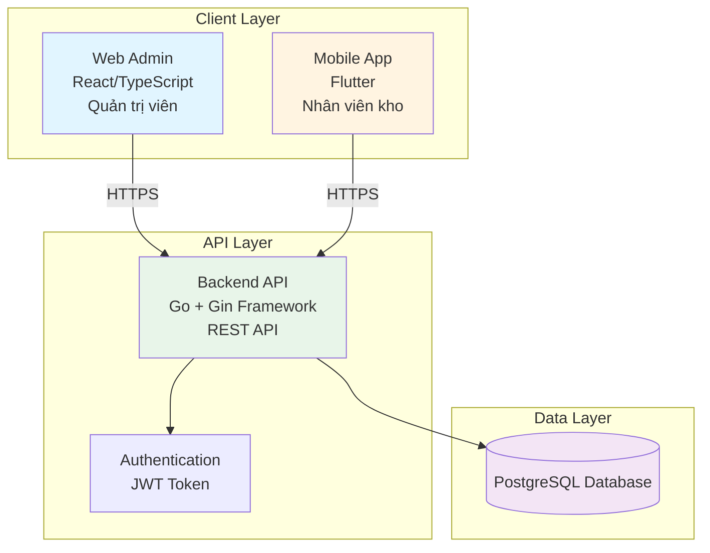
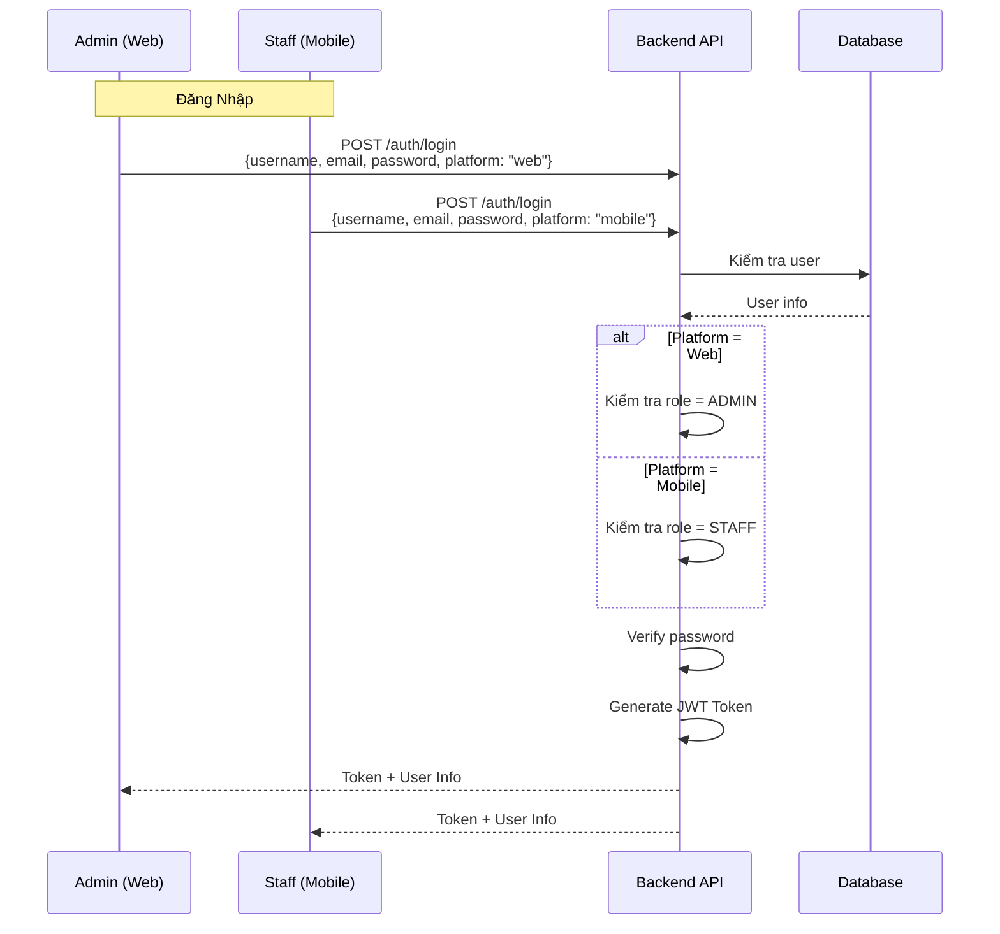
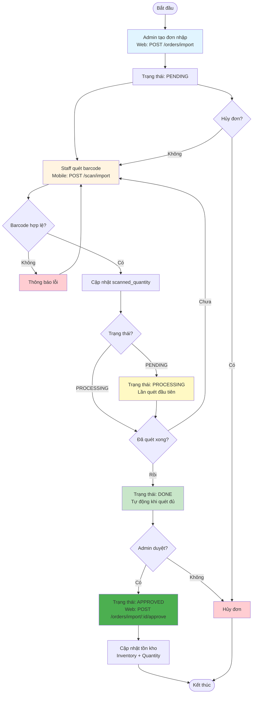
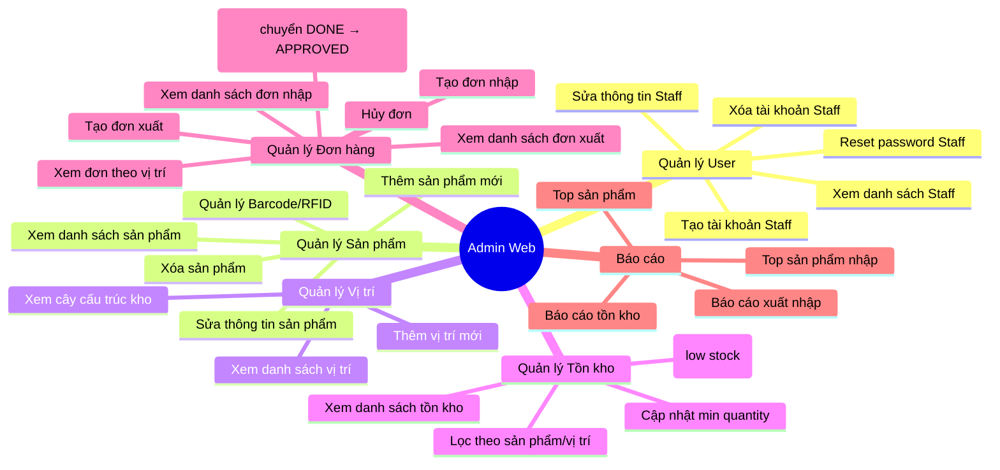
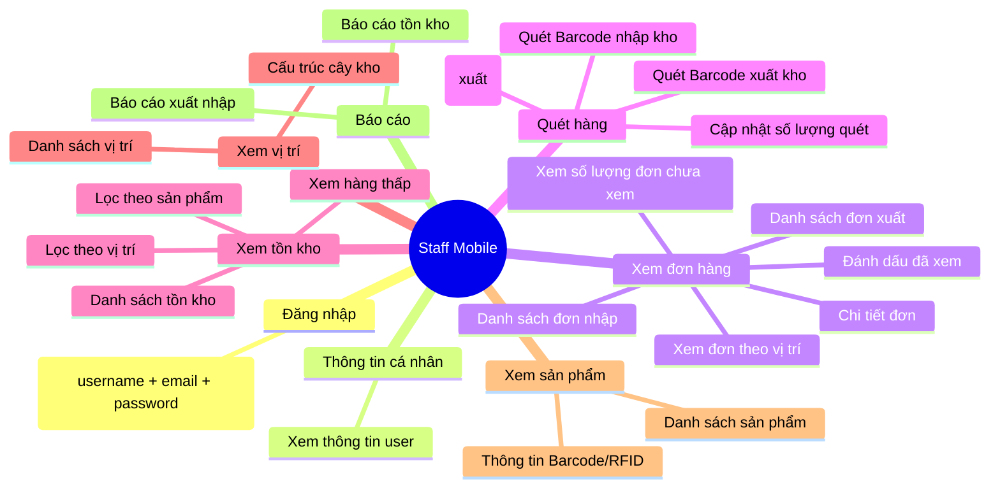
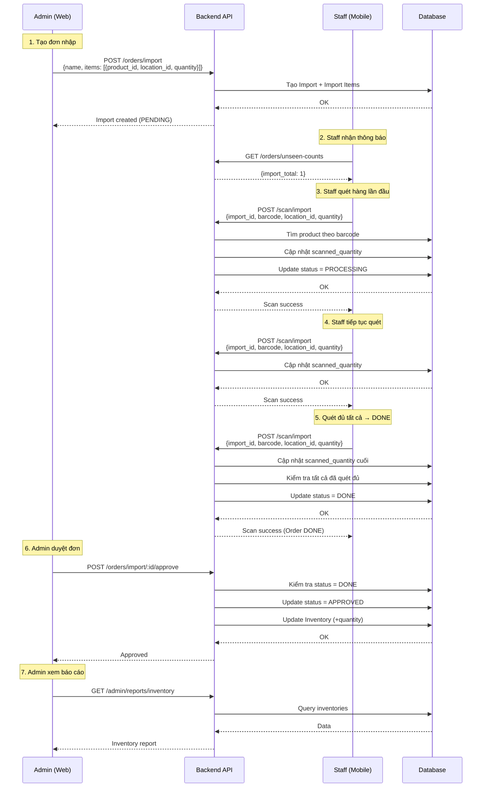
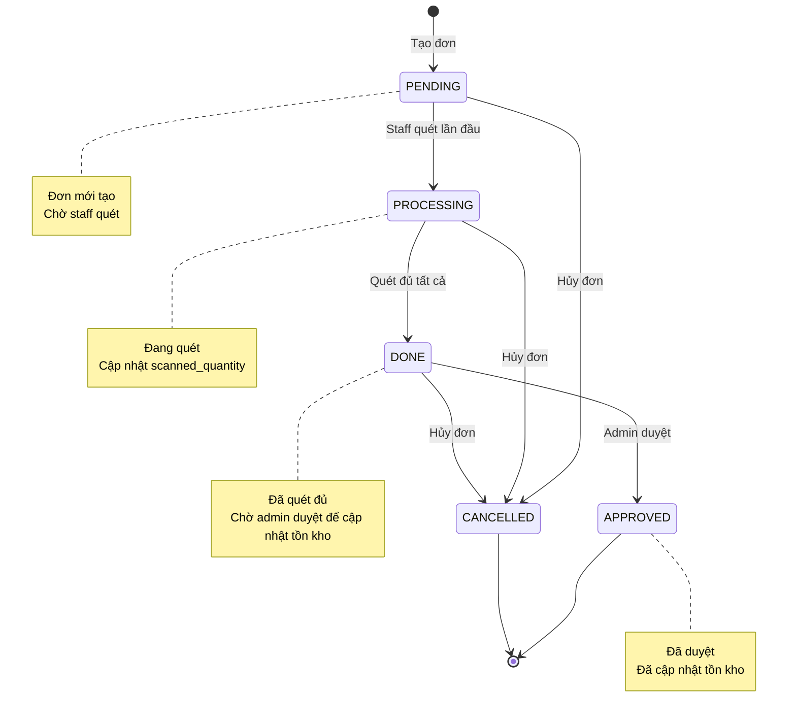

# Flow Hệ Thống Quản Lý Kho (WareFlow)

## 1. Kiến Trúc Tổng Quan

---

## 2. Luồng Đăng Nhập (Authentication)

---

## 3. Luồng Nhập Kho (Import Flow)

---

## 4. Luồng Xuất Kho (Export Flow)

---

## 5. Cấu Trúc Database

---

## 6. Chức Năng Chính Theo Vai Trò

### Admin (Web Interface)

### Staff (Mobile App)

---

## 7. Luồng Dữ Liệu Thực Tế

---

## 8. Trạng Thái Đơn Hàng

---

## 9. Tóm Tắt Quy Trình Cho Khách Hàng

### Quy trình Nhập kho
1. **Admin** tạo đơn nhập trên Web (PENDING)
2. **Staff** nhận thông báo trên Mobile
3. **Staff** quét barcode từng sản phẩm (PROCESSING)
4. **Hệ thống** tự động chuyển sang DONE khi quét đủ
5. **Admin** duyệt đơn để cập nhật tồn kho (APPROVED)
6. **Admin** xem báo cáo nhập kho

### Quy trình Xuất kho
1. **Admin** tạo đơn xuất trên Web (PENDING)
2. **Staff** nhận thông báo trên Mobile
3. **Staff** quét barcode từng sản phẩm (PROCESSING)
4. **Hệ thống** kiểm tra đủ hàng và tự động chuyển sang DONE khi quét đủ
5. **Admin** duyệt đơn để giảm tồn kho (APPROVED)
6. **Admin** xem báo cáo xuất kho

### Lợi ích
- ✅ **Theo dõi thời gian thực**: Tồn kho luôn cập nhật
- ✅ **Giảm sai sót**: Quét barcode thay vì nhập thủ công
- ✅ **Phân quyền rõ ràng**: Admin quản lý, Staff thực hiện
- ✅ **Lịch sử đầy đủ**: Mọi giao dịch đều được ghi log
- ✅ **Báo cáo tự động**: Dễ dàng xem thống kê
